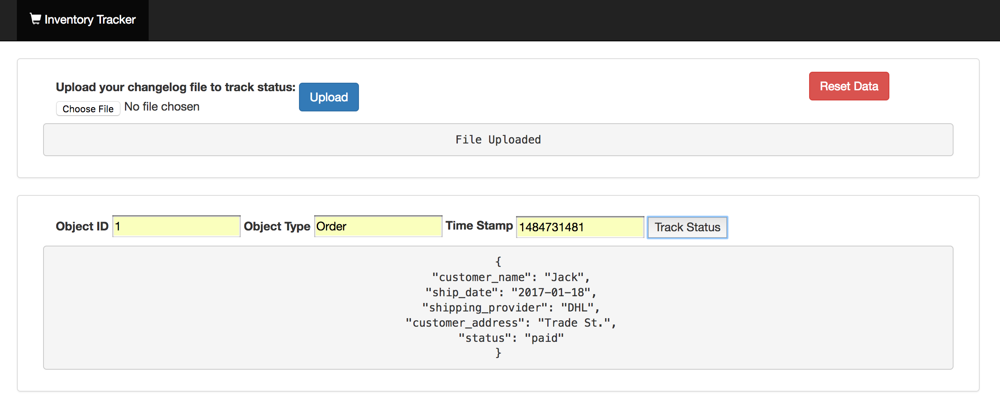
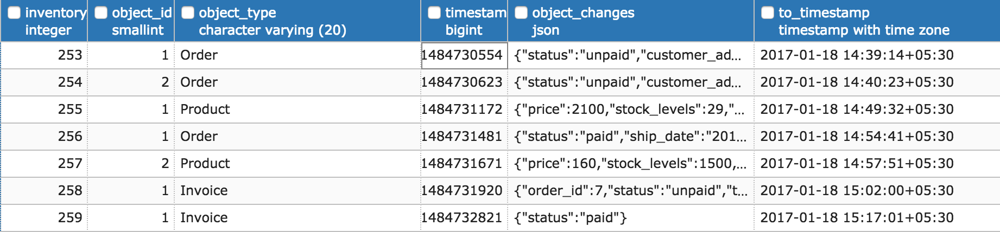

# Inventory Tracker

A Scala app (using the Play framework), to tack inventory status based on changelog.  

## Heroku Demo

- The app is deployed in heroku running on [afternoon-tundra-74790](https://afternoon-tundra-74790.herokuapp.com/)

- Refer sample changelog file [order_sample.csv](./order_sample.csv) for importing and testing inventory status.

[](https://afternoon-tundra-74790.herokuapp.com/)

## Sample Dataset

[](https://afternoon-tundra-74790.herokuapp.com/)

## Example Scenario

- What's the state of Order Id=1 At timestamp=1484733173 ?

```
{"customer_name"=>"Jack", "customer_address"=>"Trade St.", "status"=>"paid", "ship_date"=>"2017-01-18", "shipping_provider"=>"DHL"}
```
- What's the state of Order Id=1 At timestamp=1484722542 ?

```
{} # Object Didn't Exist at that time.
```

- What's the state of Order Id=1 At timestamp=1484731400 ?
```
{"customer_name"=>"Jack", "customer_address"=>"Trade St.", "status"=>"unpaid"}
```