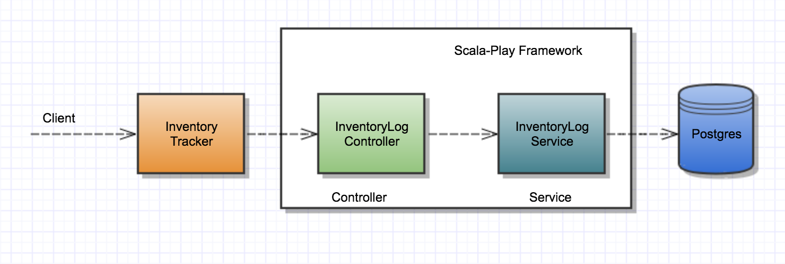
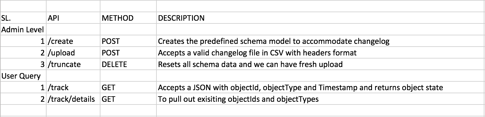

##Design Document 

### Overview 

- The Goal of this application is to record changelog from series of events in an inventory transaction and have an ability to query the system the state of transaction at a given instance.
 
App is written on

- Database: Postgres
- Back-End: Scala, 
- Framework: Play Framework
- Front-End: Javascript, Ajax and Bootstrap
 
### Design
 
#### Schema

- The CSV contains information like `object_id`, `object_type`, `timestamp` & `object_changes`. 
- `object_changes` is a json structure capturing key state information for the given `timestamp` and `object_id`.

**Schema relation**: De-normalized, since `object_id` and `object_type` uniquely identifies an entity and `timestamp` represents the object state, normalizing will not be benificial.

**Primary key choices**: 
 1. `object_id` and `object_type` together can be used as a composite key. (probable choice)
 2. `inventory_id` a new primary is used. (current choice)

*Reason*:
 - column indexing based on `numeric value` can provide better query performance with choice #2 over choice #1 which has `object_type` of data type `varchar`.
 - benefit of implicit insertion ordering based on primary key.

**Object Changes**: `json` data type is used. 
 
#### Application
 
 Controller driven design pattern, (MVC-based)
  
 
 
### Web Service (RESTful APIs)
 
  

### Challenges

**Scaling with incremental data**:

Object changes are going to be incremental, if the schema is designed to accommodate every other state change, we will end up in growing data size.

- We can trade-off with aggregating existing changelog and write only the recent state to DB. (probable choice, but dropped) Because, object changes at given time cannot be determined in a time series fashion.
